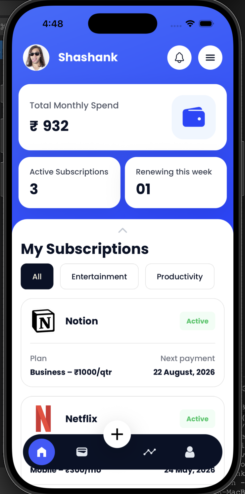
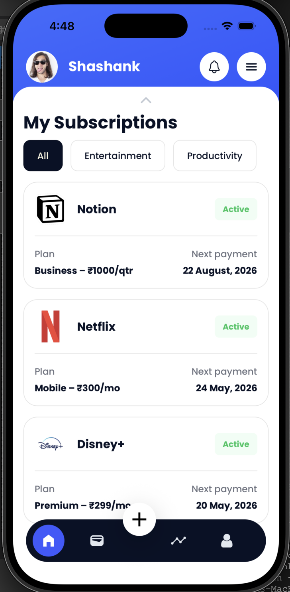
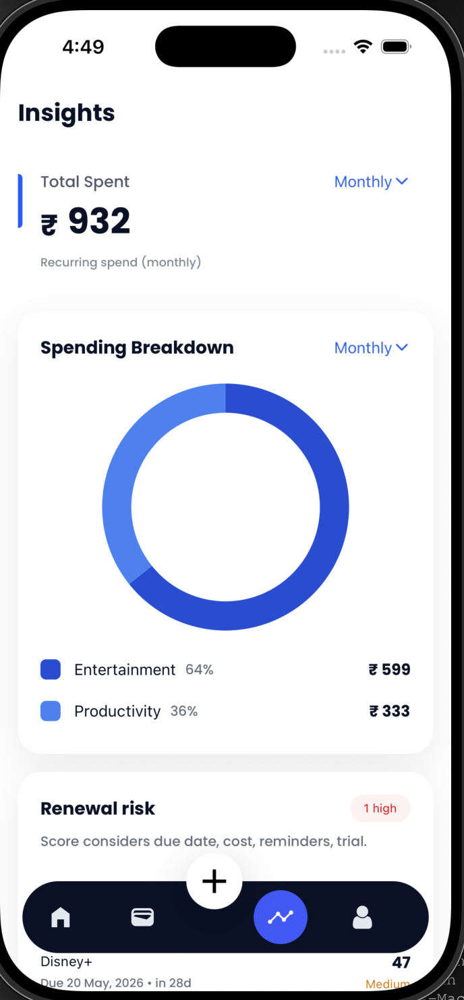
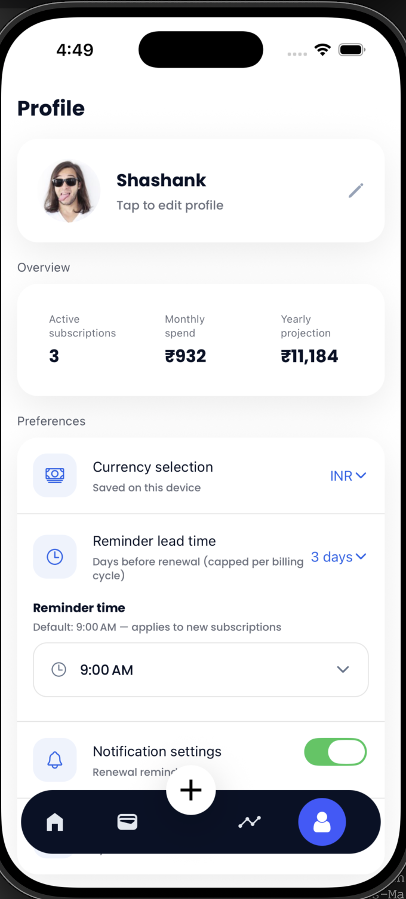
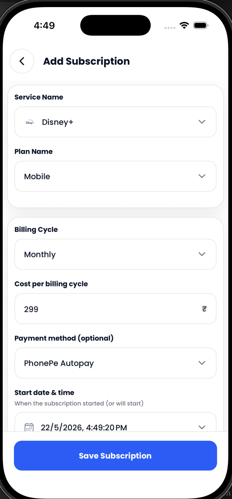
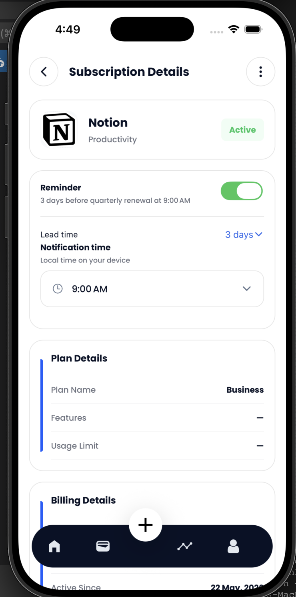

# Recurvo — Subscription Tracker

> **Never be surprised by a renewal again.**
> Recurvo is a clean, offline-first mobile app that tracks all your subscriptions, reminds you before renewals, and shows exactly where your money goes — no account, no internet required.

---

## 📱 What Is Recurvo?

Most people forget about subscriptions until money disappears from their account. Recurvo fixes that.

You add your subscriptions once. Recurvo tracks every renewal date, sends you reminders before you're charged, and gives you a clear picture of your monthly and yearly spending — all stored locally on your device. No cloud, no sign-up, no data sharing.

**Who is it for?**
Anyone who pays for recurring services — streaming, SaaS tools, gym memberships, app subscriptions — and wants a simple way to stay aware and in control.

---

## ✨ Features

### Subscription Management
- Add subscriptions manually or pick from a quick-add list of popular services
- Edit, pause, resume, or cancel any subscription
- Delete subscriptions you no longer need
- Supports **weekly, monthly, quarterly, and yearly** billing cycles
- Automatically calculates the next renewal date on every cycle

### Renewal Tracking
- See all upcoming renewals at a glance
- Home screen widget for upcoming renewals
- Track free trial expiration dates separately
- Timeline / calendar view of all upcoming charges

### Smart Notifications
- Reminders before renewal (configurable)
- Same-day payment reminders
- Trial-ending alerts
- Act directly from the notification:
  - ✅ Mark as Paid
  - 💤 Snooze
  - ❌ Cancel subscription
- Full notification history screen

### Insights & Analytics
- Monthly recurring spend
- Yearly projection
- Active subscription count
- Category-wise spending breakdown
- Upcoming expense forecast
- Potential savings suggestions

### User Experience
- Category filtering
- Service logos for quick recognition
- Swipe actions on subscription cards
- Meaningful empty states
- Calm, minimal UI — no clutter

---

## 🏗️ Architecture

Recurvo is built with a clean **3-layer architecture** that separates concerns clearly and makes the codebase easy to extend.

```
┌─────────────────────────────┐
│         UI Layer            │  Screens, components, user interactions
├─────────────────────────────┤
│       Service Layer         │  Business logic, renewal calculations,
│                             │  notification orchestration, lifecycle mgmt
├─────────────────────────────┤
│      Repository Layer       │  All database reads/writes (SQLite only)
├─────────────────────────────┤
│       SQLite Database       │  Local persistent storage (expo-sqlite)
└─────────────────────────────┘
```

### Core App Flow

```
User Action
    → Service Layer        (business logic runs)
    → Database Update      (SQLite via Repository)
    → Notification Sync    (reminders rescheduled if needed)
    → UI Refresh           (state updates reflected)
```

Every user action — adding, editing, pausing, cancelling a subscription — flows through the Service Layer first. The UI never talks to the database directly.

---

## 🛠️ Tech Stack

| Layer            | Technology                     | Purpose                                                   |
| ---------------- | ------------------------------ | --------------------------------------------------------- |
| Framework        | Expo React Native + TypeScript | Cross-platform iOS & Android                              |
| State Management | Redux Toolkit                  | UI state, filters, modals, temporary state                |
| Local Database   | SQLite (`expo-sqlite`)         | Subscriptions, categories, notifications, settings        |
| Notifications    | `expo-notifications`           | Scheduling, cancelling, rescheduling reminders            |
| Date Logic       | `date-fns`                     | Renewal calculations, billing cycle logic, reminder dates |

### Why these choices?

**SQLite over AsyncStorage** — Subscriptions are relational data. SQLite gives proper querying, filtering, and relationships between subscriptions, categories, and reminder settings. AsyncStorage would mean loading everything into memory and filtering in JS.

**Redux Toolkit over plain Redux** — RTK eliminates boilerplate while keeping the predictable state management pattern. Used strictly for UI state (filters, modals, temporary state) — all persistent data stays in SQLite, keeping the two concerns cleanly separated.

**Offline-first by design** — There is no backend. Every calculation, reminder, and insight runs on-device. This means the app works instantly with zero latency and zero privacy concerns.

**date-fns over moment.js** — Smaller bundle, tree-shakeable, immutable date handling. Important for a mobile app where bundle size and predictability matter.

---

## 📂 Project Structure

```
recurvo/
├── src/
│   ├── screens/          # All app screens (Home, Detail, Insights, etc.)
│   ├── components/       # Reusable UI components
│   ├── services/         # Business logic (SubscriptionService, NotificationService, etc.)
│   ├── repositories/     # Database layer (SQLite queries only)
│   ├── store/            # Redux Toolkit slices (UI state)
│   ├── types/            # TypeScript interfaces and types
│   └── utils/            # Helpers (date calculations, formatters, constants)
├── assets/               # Icons, logos, images
├── app.json              # Expo config
└── README.md
```

---

## 🔔 Notification Engine

The notification system is one of the more complex parts of Recurvo. Here's how it works:

1. When a subscription is **added or edited**, the Service Layer calculates all upcoming reminder dates based on the renewal date and user's reminder preferences.
2. These dates are passed to the **Notification Engine**, which schedules local notifications via `expo-notifications`.
3. When a subscription is **paused or cancelled**, all scheduled notifications for that subscription are cancelled by ID.
4. When a subscription **renews** (next cycle begins), the engine automatically reschedules reminders for the new renewal date.
5. Notification **actions** (Mark Paid, Snooze, Cancel) are handled in the background — the app doesn't need to be open.

---

## 🧠 Design Decisions

### What Recurvo intentionally does NOT do

These features were considered and deliberately left out:

| Feature                     | Why excluded                                                                                      |
| --------------------------- | ------------------------------------------------------------------------------------------------- |
| Bank sync / Open Banking    | Adds complexity, privacy risk, and account setup friction — against the "zero friction" principle |
| OCR receipt scanning        | Unreliable, requires camera permissions, overkill for the use case                                |
| AI-powered automation       | Adds unpredictability; users should feel in control of their data                                 |
| Cloud sync / Authentication | Forces account creation; kills the offline-first model                                            |
| SMS / email parsing         | Requires sensitive permissions; high false-positive rate                                          |
| Social / community features | Out of scope for a focused utility app                                                            |

The goal is a **calm, reliable utility** — not a feature-packed platform.

### Offline-first principle

Every feature works with zero internet connection. Renewal calculations, reminders, insights, and all CRUD operations run entirely on-device. This is a deliberate product decision — a subscription tracker that requires internet to work is unreliable by definition.

---

## 🚀 Getting Started

### Prerequisites
- Node.js 18+
- Expo CLI (`npm install -g expo-cli`)
- iOS Simulator (Mac) or Android Emulator / physical device

### Installation

```bash
# Clone the repository
git clone https://github.com/yourusername/recurvo.git
cd recurvo

# Install dependencies
npm install

# Start the development server
npx expo start
```

### Run on device

```bash
# iOS
npx expo run:ios

# Android
npx expo run:android
```

---

## 📸 Screenshots
<table>
  <tr>
    <td></td>
    <td></td>
    <td></td>
  </tr>
  <tr>
    <td></td>
    <td></td>
    <td></td>
  </tr>
</table>
---

## 🗺️ Roadmap

- [ ] Play Store / App Store release
- [ ] Home screen widget (Android)
- [ ] CSV export of subscriptions
- [ ] Currency support (multi-currency)
- [ ] Dark mode
- [ ] iPad / tablet layout

---

## 👨‍💻 Author

**Shashank Rai** — Senior Software Engineer
[LinkedIn](https://linkedin.com/in/shashankrai01) · [GitHub](https://github.com/shanky1001) · [Portfolio](https://shashank-rai-dev.netlify.app/)

---

## 📄 License

MIT License — free to use, modify, and distribute.